# Euno — Architecture Overview

> **Status:** ✅ Reflects current code in `packages/` as of April 2026.
>
> This document is the consolidated architecture reference for Euno
> *as implemented in this repository*. It complements (not replaces):
>
> - [`IMPLEMENTATION.md`](./IMPLEMENTATION.md) — package-by-package summary.
> - [`diagrams.md`](./diagrams.md) — abstract / engineering / executive
>   diagram set framed around the **design pattern** (capability-native
>   agent governance), not this specific code base.
> - [`diagrams.md`](./diagrams.md) — AGT (semantic guard) ↔ gateway
>   (cryptographic guard) interaction diagrams (Set D).
> - [`capability-model.md`](./capability-model.md) — gap analysis &
>   security model rationale.
> - [`enforcement.md`](./enforcement.md) — why the gateway is the PDP.
>
> Where a diagram in this file conflicts with the older abstract
> diagrams, **this file is authoritative for the implementation**;
> older docs remain authoritative for the conceptual / pattern view.

---

## 1. System purpose, in one paragraph

Euno is a **capability-native zero-trust governance plane for AI
agents**. Every agent action is mediated by a cryptographically
verifiable, time-limited capability token issued by a central
**Capability Issuer**, attenuated as it flows through delegation
chains, and enforced by a **Tool Gateway** that acts as the reference
monitor in front of every protected backend. The gateway emits signed
audit evidence to a SIEM, and an out-of-band **kill switch** /
revocation list lets operators cut off any agent, session, or token in
seconds. The whole control plane is cloud-portable through pluggable
identity-provider and signer adapters (Azure AD + Key Vault,
AWS Cognito + KMS, GCP Cloud Identity + Cloud KMS, W3C DID + DID-bound
keys).

---

## 2. C4 Level 1 — System context

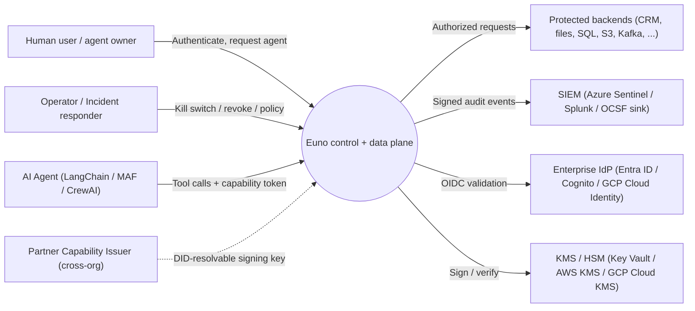

**External actors and systems**

| Actor / system           | Role                                                                                  |
| ------------------------ | ------------------------------------------------------------------------------------- |
| Human user / agent owner | Authenticates via OIDC, optionally provides a `UserConsent` record per agent          |
| Operator                 | Drives the Admin API on the gateway; owns kill-switch & revocation                    |
| AI agent                 | Runs inside `agent-runtime`; framework code is wrapped by `framework-adapters`        |
| Protected backend        | Sits behind the Tool Gateway proxy; no direct network path from the agent runtime     |
| Enterprise IdP           | OIDC issuer; identity providers map IdP claims → `UserContext` + role set             |
| KMS / HSM                | Holds the private signing key; only digests cross the boundary                        |
| Partner issuer           | Foreign capability issuer trusted via a DID document (cross-org federation)           |
| SIEM                     | Sink for the gateway's signed audit events and Sentinel analytic-rule firings         |

---

## 3. C4 Level 2 — Container / package view

The repository is a TypeScript monorepo (`packages/*`). Each container
maps 1:1 to a workspace under `packages/`.

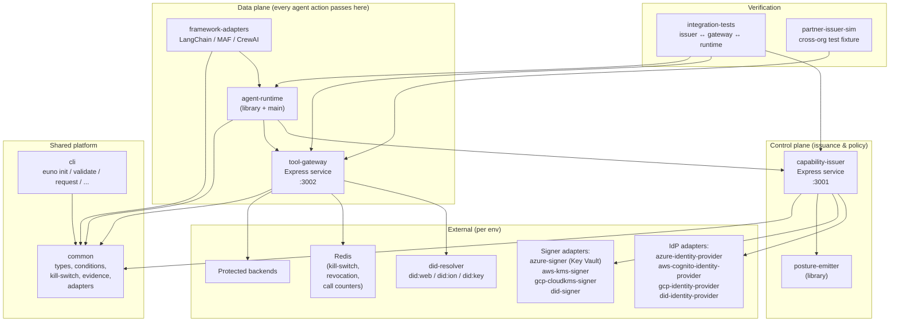

### Package responsibilities (as implemented)

| Package                              | LOC (approx) | Public surface                                                                                          |
| ------------------------------------ | ------------ | ------------------------------------------------------------------------------------------------------- |
| `packages/common`                    | shared       | Types split into two opt-in subpaths — `@euno/common/wire` (JWT/HTTP shapes: `CapabilityTokenPayload`, `CapabilityCondition` discriminated union, issue/validate/audit/storage/db payloads) and `@euno/common/runtime` (in-process surfaces: `UserContext`, `ResolvedRole`, `AgentInventoryRecord`, `EvidenceSigner`, `IdentityProvider`, `TokenSigner/Verifier`, `KillSwitchManager`, `ServiceConfig` and friends) — plus `ConditionRegistry`, `KillSwitchManager` (in-mem + Redis), `EvidenceSigner`, `CallCounterStore`, role mapping, validators. The bare `@euno/common` entry point still re-exports the union of both subpaths for back-compat. |
| `packages/capability-issuer`         | ~1.6k (service) | HTTP service: `/api/v1/issue`, `/api/v1/attenuate`, `/api/v1/renew`, `/api/v1/public-key`, `/.well-known/did.json`, `/.well-known/capability-issuer`; pluggable identity & signer registries; storage-grant + DB-token side services |
| `packages/tool-gateway`              | ~0.7k (service) | HTTP service: `/proxy/*`, `/api/v1/validate`, `/admin/*`; JWT verifier, enforcement engine, partner-issuer resolver, revocation store |
| `packages/agent-runtime`             | small        | `EunoAgentRuntime` class + `main.ts` entry point; transparent token mint / refresh; routes every tool call through the gateway |
| `packages/framework-adapters`        | small        | LangChain / MAF / CrewAI middleware preserving correlation IDs and error shape |
| `packages/posture-emitter`           | small        | Emits `AgentInventoryRecord`s on issuance / revocation for SIEM-side posture inventory |
| `packages/cli`                       | small        | `euno init`, `validate`, `request`, `config`, `schema-version`, `check`, `plan`, `validate-token` |
| `packages/integration-tests`         | tests        | E2E issuer ↔ gateway ↔ runtime harness |
| `packages/partner-issuer-sim`        | tests        | Stand-in foreign issuer for cross-org tests |

Total source ≈ **19.5k LOC**, tests ≈ **13.8k LOC** (≈ 0.7 ratio), nine
workspaces.

---

## 4. C4 Level 3 — Internal structure of the two services

### 4.1 Capability Issuer (`packages/capability-issuer/src/`)

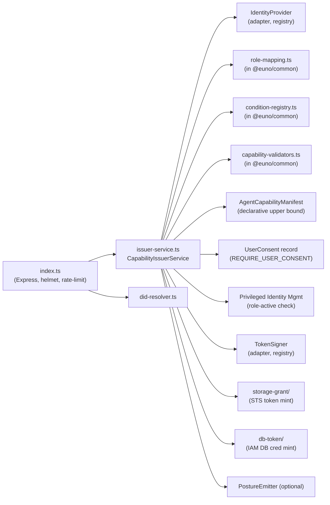

Notable design choices visible in the code:

- **Discriminated-union conditions** (`CapabilityCondition` in
  `common/src/types.ts`) are validated *at mint time* by
  `validateConditions(...)` — unknown `type` ⇒ hard reject. No
  fail-open path.
- **Action type widened to `string`** (`Action = string`) so tokens can
  carry resource-specific verbs (`db:select`, `s3:putObject`) while the
  `LEGACY_ACTIONS` tuple keeps the original five generic verbs
  meaningful for role mapping. Conditional-Access tiering (the
  former `actionToCaTier` heuristic) is now driven by the pluggable
  **`ActionResolver`** in `@euno/common` (R-7); the default resolver
  ships an explicit per-verb table and operators ship a JSON file via
  `ACTION_RESOLVER_FILE` to extend it for deployment-specific verbs
  without modifying source.
- **Consent gate** (`requireConsent: boolean` + `SENSITIVE_ACTIONS` set
  for `write|delete|admin`) — in strict mode the issuer refuses to mint
  any sensitive capability without a validated `UserConsent` payload.
- **PIM cap on TTL** — `PIM_TTL_SAFETY_MARGIN_SECONDS = 30` clips token
  expiry to `min(requested_exp, PIM_endDateTime − 30s)` so a JIT role
  expiry always wins over a longer-lived capability.
- **Schema version is mandatory** — `CAPABILITY_TOKEN_SCHEMA_VERSION =
  '1.0'`; gateways reject anything not in `SUPPORTED_SCHEMA_VERSIONS`
  (fail-closed evolution).
- **JWKS endpoint (R-6)** — `GET /.well-known/jwks.json` exposes the
  active signing key(s) as a standards-compliant JWK Set. Every minted
  token carries a `kid` in its JWS protected header that matches one of
  the published keys, enabling **key rotation without a synchronised
  restart**: add key 2 → wait one cache TTL → switch signing to key 2
  → wait one TTL → remove key 1. The legacy `GET /api/v1/public-key`
  endpoint remains operational (returns the active key's SPKI PEM with
  a `Deprecation` response header) for one deprecation cycle.

### 4.2 Tool Gateway (`packages/tool-gateway/src/`)

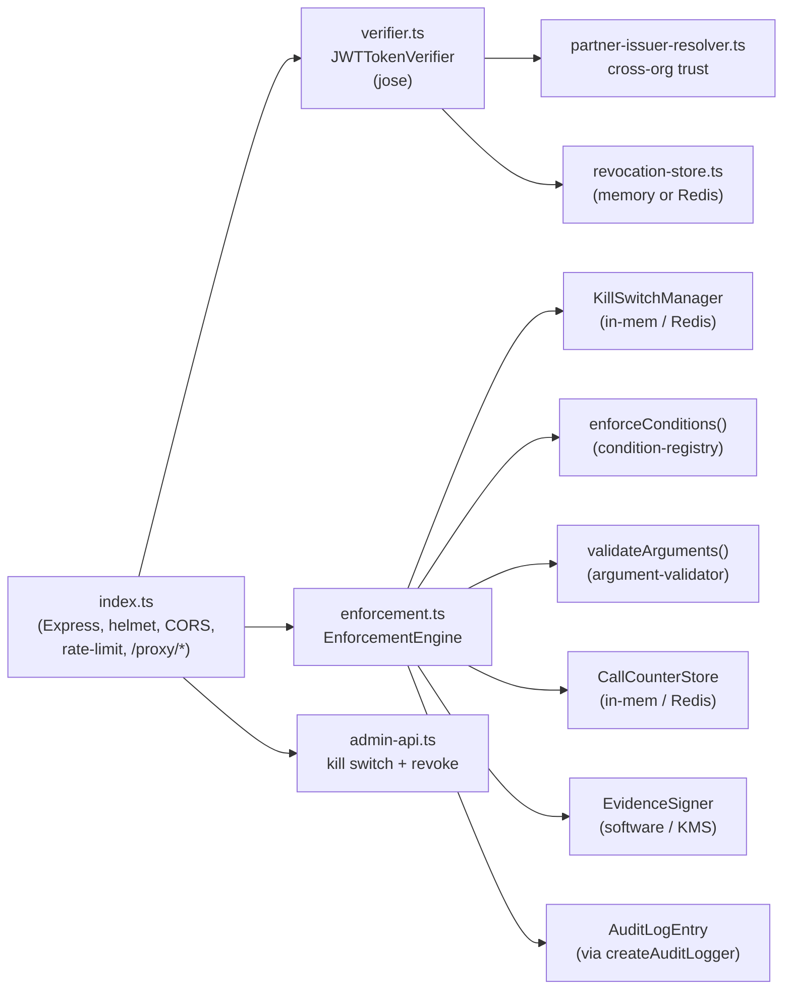

Notable design choices visible in the code:

- **Resource canonicalisation** in `createTargetHostCanonicalizeMiddleware` +
  `createValidateCapabilityMiddleware` (`routes/proxy.ts`): the gateway
  derives the protected resource as `api://{host}/{tail}` **exclusively from
  the URL path** using a two-middleware pipeline:
  1. `createTargetHostCanonicalizeMiddleware` (strip-and-rewrite) — runs
     first and unconditionally strips any incoming `X-Target-Host` header,
     then rewrites it from the first URL-path segment if that segment
     matches the host pattern.  This ensures the header is always
     path-canonical and never a client-controlled value, even if a
     misconfigured or malicious L7 hop (ingress, service mesh, sidecar)
     forwarded the header without overwriting it.  A `warn` is emitted when
     the stripped value differed from the path-derived one.
  2. `createValidateCapabilityMiddleware` — reads `X-Target-Host` (now
     guaranteed path-derived) to construct the `api://` resource URI for
     capability enforcement; a residual mismatch check remains as
     defense-in-depth for callers that bypass the canonicalize middleware.
  The Envoy shard router additionally strips `x-target-host` from incoming
  requests (`k8s/envoy-shard-router.yaml`) before they reach the gateway,
  providing a second enforcement point at the ingress layer.
- **HTTP-method → action mapping** is supplied by the pluggable
  `ActionResolver` from `@euno/common` (R-7). The built-in default
  preserves the legacy table (`GET→read`, `POST/PUT/PATCH→write`,
  `DELETE→delete`); deployments override it by pointing the gateway
  at an `ACTION_RESOLVER_FILE` JSON config — the same file the issuer
  consumes for CA tiering, so mint-time and enforcement-time action
  vocabularies stay aligned.
- **Fail-closed cryptographic audit** — `ENABLE_CRYPTOGRAPHIC_AUDIT=true`
  refuses to start without a configured `EvidenceSigner` (`index.ts`
  ll. 135–156). No silent unsigned audit.
- **Distributed by env var** — when `REDIS_URL` is set, kill-switch,
  revocation list, and call-counter store are upgraded from in-process
  to Redis-backed; in-process is dev-only.

---

## 5. Dataflow diagrams

### 5.1 DFD-0 — Whole-system control vs. data plane

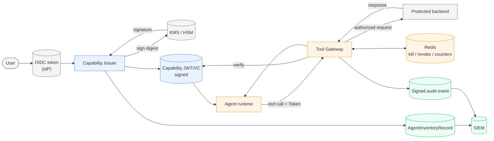

**Trust-boundary legend:** Blue = control plane (mint), Orange = data
plane (every action), Grey = external trust roots, Green =
observability sinks. The agent runtime sits on the **untrusted** side
of the gateway — the gateway is the *only* PDP and PEP for protected
backends.

### 5.2 DFD-1 — Agent boot and first tool call (decomposed)

```mermaid
flowchart TB
    A1["Agent runtime starts<br/>(with AuthTokenProvider,<br/>IssuanceHintsProvider)"]
    A2["Agent runtime: POST /api/v1/issue<br/>(OIDC bearer + hints)"]
    A3["Issuer: validate IdP token<br/>→ UserContext + roles"]
    A4["Issuer: load AgentCapabilityManifest<br/>+ UserConsent (if required)"]
    A5["Issuer: roles → capabilities<br/>∩ manifest ∩ explicit request"]
    A6["Issuer: validateConditions()<br/>(reject unknown type)"]
    A7["Issuer: build payload<br/>{iss,sub,aud,exp,jti,cap,schemaVersion}"]
    A8["Issuer: KMS.sign(digest)"]
    A9["Issuer → Agent: signed JWT"]
    B1["Agent: tool call<br/>(framework adapter)"]
    B2["Runtime → Gateway: HTTPS<br/>Authorization: Bearer + body + X-Target-Host"]
    B3["Gateway: parse + canonicalise resource"]
    B4["Verifier: JWS verify<br/>(local SPKI or partner DID document key)"]
    B5["Verifier: schemaVersion ∈ supported?"]
    B6["Verifier: revocationStore.has(jti)?"]
    B7["Engine: KillSwitch.check(global, agent, session)"]
    B8["Engine: isActionAllowed(action, resource, cap[])"]
    B9["Engine: enforceConditions(...)<br/>(time, IP, maxCalls, ...)"]
    B10["Engine: validateArguments(body)<br/>(if argumentSchema)"]
    B11["Engine: emit signed AuditLogEntry"]
    B12["Gateway: proxy to backend → 2xx"]

    A1-->A2-->A3-->A4-->A5-->A6-->A7-->A8-->A9
    A9-->B1-->B2-->B3-->B4-->B5-->B6-->B7-->B8-->B9-->B10-->B11-->B12
```

### 5.3 DFD-2 — Cross-org enforcement

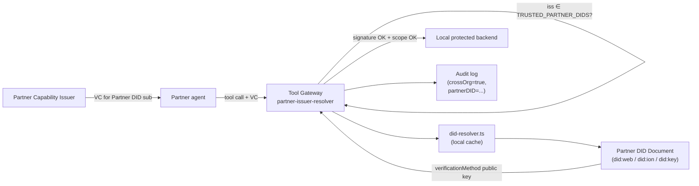

When the issuer claim (`iss`) is in `TRUSTED_PARTNER_DIDS`, the gateway
fetches the partner's DID document, extracts the
`verificationMethod`, and uses *that* key (not the local SPKI key) to
verify the signature. `LOCAL_ISSUER_IDS` is the symmetric guard that
prevents the local key from being abused to impersonate a foreign DID.

---

## 6. Sequence diagrams (implementation-level)

These reflect the *actual* request paths in the current code, so
maintainers can trace each line against the source.

### 6.1 Issuance — `POST /api/v1/issue`

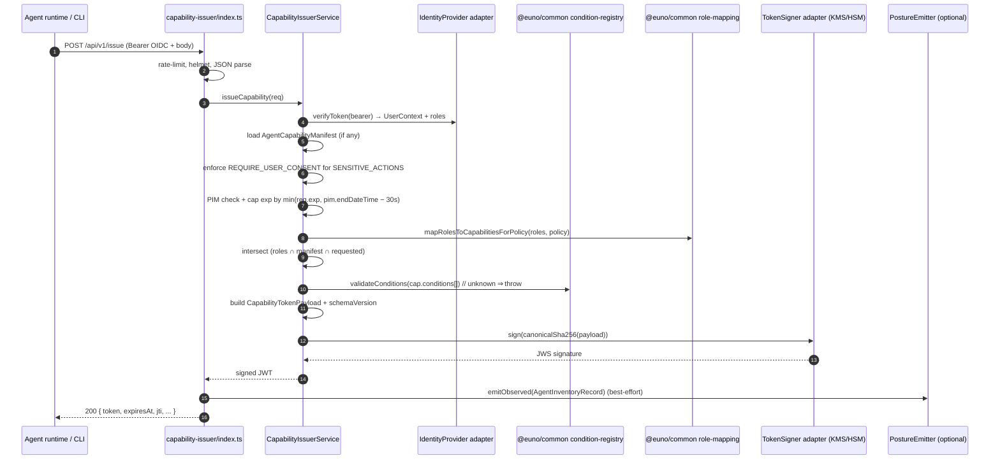

### 6.2 Enforcement — `ANY /proxy/*`

```mermaid
sequenceDiagram
    autonumber
    participant Agent
    participant GW as tool-gateway/index.ts
    participant Ver as JWTTokenVerifier
    participant Rev as RevocationStore
    participant Resolver as PartnerIssuerResolver
    participant Eng as EnforcementEngine
    participant KS as KillSwitchManager
    participant Cond as enforceConditions()
    participant CCS as CallCounterStore
    participant Audit as AuditLogger + EvidenceSigner
    participant Backend

    Agent->>GW: REQUEST /proxy/<host>/<path>  (Bearer JWT, X-Target-Host)
    GW->>GW: canonicalise → api://host/path
    GW->>Ver: verify(token)
    Ver->>Resolver: resolve issuer key (local SPKI or partner DID)
    Resolver-->>Ver: public key
    Ver->>Ver: jose verify + schemaVersion check
    Ver->>Rev: has(jti)?
    Rev-->>Ver: revoked? → if so throw 401
    Ver-->>GW: CapabilityTokenPayload
    GW->>Eng: validateAction({token, action, resource, context})
    Eng->>KS: check(global, agent, session)
    KS-->>Eng: allow / kill
    Eng->>Eng: isActionAllowed(action, resource, cap.actions, cap.resources)
    Eng->>Cond: enforceConditions(cap.conditions, ctx)
    Cond->>CCS: increment(jti, windowSeconds) for maxCalls
    CCS-->>Cond: under-limit?
    Cond-->>Eng: allow / deny + reason
    Eng->>Audit: write entry; if crypto-audit, sign(entry)
    Eng-->>GW: { allowed: true }
    GW->>Backend: proxy request (httpProxy)
    Backend-->>GW: response
    GW-->>Agent: response
```

### 6.3 Attenuation (delegation) — `POST /api/v1/attenuate`

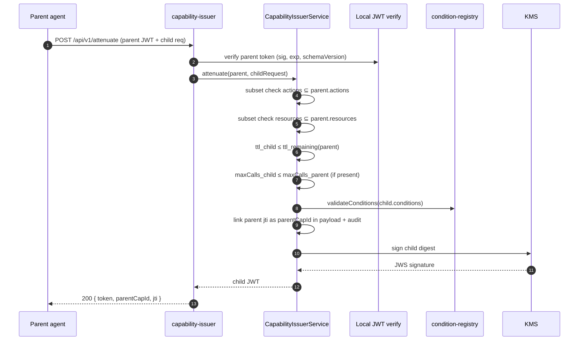

If any subset check fails → `400 NO_NEW_PRIVS` and an audit event with
`outcome=delegation_denied`.

### 6.4 Renewal — `POST /api/v1/renew`

```mermaid
sequenceDiagram
    autonumber
    participant Agent
    participant API as capability-issuer
    participant Svc as CapabilityIssuerService
    participant IdP
    participant KMS

    Agent->>API: POST /api/v1/renew (current JWT + fresh OIDC)
    API->>Svc: renew(currentToken, oidcToken)
    Svc->>IdP: re-verify OIDC + reread roles
    Svc->>Svc: assert roles still cover current capabilities
    Svc->>Svc: assert PIM role still active (if applicable)
    Svc->>Svc: bump iat / exp; preserve sub, jti chain
    Svc->>KMS: sign renewed payload
    KMS-->>Svc: signature
    Svc-->>API: renewed JWT
    API-->>Agent: 200 { token, expiresAt }
```

The renewal does **not** widen scope; it can only re-prove the
identity and reset expiry. A change in role membership produces a
narrower (or denied) renewal — never a wider one.

### 6.5 Kill switch & revocation propagation

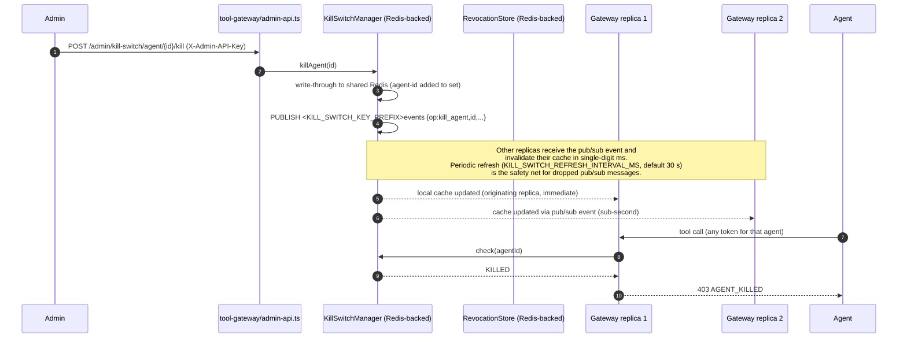

Targeted token revocation (`POST /admin/revoke/{jti}`) follows the
same shape but writes to `RevocationStore`; the revocation is
immediate in the shared Redis store and is enforced on the next
request, when the verifier checks `jti` during token verification.
Kill-switch propagation across replicas is sub-second under normal
conditions because every mutation is broadcast on a Redis pub/sub
channel; the periodic refresh
(`KILL_SWITCH_REFRESH_INTERVAL_MS`, default 30 s) acts as a safety net
for the rare case of a dropped pub/sub message.  The originating
replica observes the change immediately via write-through.

### 6.6 Posture inventory emission

```mermaid
sequenceDiagram
    autonumber
    participant Svc as CapabilityIssuerService
    participant Q   as SQLite WAL queue<br/>(DurablePostureEmitter)
    participant W   as DeliveryWorker<br/>(background)
    participant SIEM

    Note over Svc: Step 5 — signPayload() completes
    Svc->>+Q: await emitObserved(record)<br/>(synchronous SQLite INSERT, < 1 ms)
    Q-->>-Svc: resolves — record is durable
    Note over Svc: HTTP response sent
    W->>Q: peek(batch)
    Q-->>W: events
    W->>SIEM: deliver (HTTP / log transport)
    alt success
        W->>Q: ack(id)
    else transient failure
        W->>Q: nack(id, nextRetryAt)
        Note over W: exponential back-off; dead-letter after maxAttempts
    end
```

Posture inventory is **transactionally consistent with issuance**:
the `DurablePostureEmitter.emitObserved` call is `await`-ed
immediately after `signPayload` (Step 5b of the issuance pipeline),
so the SQLite WAL write completes *before* the HTTP response is sent.
A process crash after that point leaves the record in the on-disk
queue, where the `DeliveryWorker` will pick it up on the next pod
start.

The `DeliveryWorker` background loop fans out to cloud surfaces
(Defender CSPM / Security Hub / SCC) asynchronously; plugin delivery
failures are retried with exponential back-off and dead-lettered after
`POSTURE_DURABLE_MAX_ATTEMPTS` exhaustion.  A plugin outage therefore
never affects issuance latency, and dead-lettered events are counted
via the `euno_issuer_posture_dead_lettered_total` Prometheus counter.

**Remaining gap:** the crash window between `signPayload` completing
and the SQLite `push` call completing is sub-millisecond but non-zero.
Closing it entirely would require either (a) a single atomic
transaction spanning KMS and SQLite (impractical) or (b) idempotent
re-issuance on crash recovery (out of scope).  The current design is
the best practical approximation: enqueue-before-response with a WAL
queue that survives pod restarts.

The issuer service treats the emitter as `PostureEmitterLike`
(structural interface), so `issuer-service.ts` is interface-based and
can be wired with any compatible emitter implementation — see
`issuer-service.ts` ll. 41–52. (The service entry point
`capability-issuer/src/index.ts` wires the concrete
`DurablePostureEmitter`; the structural-interface boundary is at the
service class, not the package.)

Set `POSTURE_DURABLE_QUEUE_PATH` to a writable path on a persistent
volume in production (e.g. `/var/lib/euno/posture-queue.db`);
omitting it defaults to `':memory:'` which loses the queue on pod
restart and is equivalent to the old best-effort behaviour.

---

## 7. Deployment view

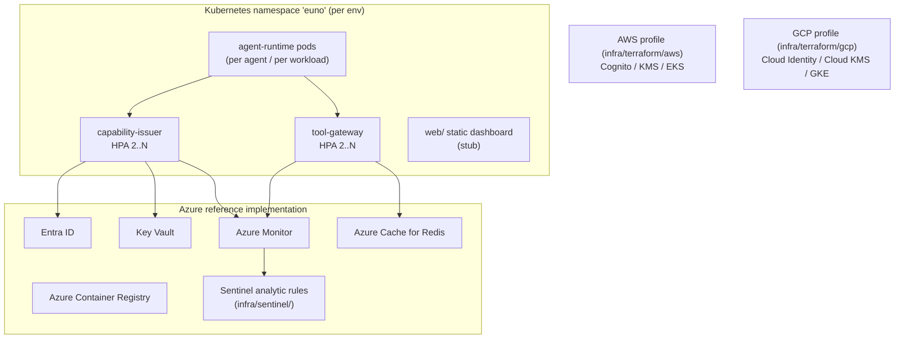

Pod-security baseline (see `k8s/pod-security-standards.yaml`,
`network-policies.yaml`, `ha-policies.yaml`):

- `restricted` PSS profile, non-root UID (1001/1002), read-only rootfs
  with tmpfs scratch.
- Default-deny network policy; only the gateway egresses to backends.
- HPA + PDB on issuer & gateway; resource quotas at namespace level.
- AppArmor / SELinux profiles enabled where the cluster supports them.

---

## 8. Cross-cutting concerns

| Concern             | Where it lives                                                | Notes                                                                |
| ------------------- | ------------------------------------------------------------- | -------------------------------------------------------------------- |
| AuthN (humans)      | IdP adapters in `capability-issuer/src/*-identity-provider.ts`| OIDC at the boundary; never inside the rest of the system            |
| AuthN (services)    | Cloud-managed identity (workload identity / managed identity) | Issuer→KMS, gateway→Redis, etc.                                      |
| AuthZ (capabilities)| `enforcement.ts` + `condition-registry.ts`                    | Single PDP+PEP at the gateway                                        |
| Crypto signing      | `signer.ts` adapter; `azure-signer.ts`, `aws-kms-signer.ts`, etc. | KMS never sees the message body — digest only                    |
| Key rotation (R-6)  | `GET /.well-known/jwks.json` (issuer); `JwksClient` (gateway) | Issuer publishes a JWK Set; every token carries a `kid`. Gateway caches JWKS with a configurable TTL (`EUNO_JWKS_CACHE_TTL_SECONDS`, default 300 s) and refreshes on `kid` miss (no restart needed). Rotation procedure: add key 2 → wait one TTL → sign with key 2 → wait one TTL → remove key 1. Strict `kid` enforcement: tokens without a `kid` are rejected when `EUNO_REQUIRE_KID=true` (default). |
| Audit               | `evidence.ts` + `createAuditLogger` + `EvidenceSigner`        | Fail-closed: cannot enable crypto-audit without a signer             |
| Observability       | `logger.ts` + `log-transports.ts` + Sentinel rules             | OpenTelemetry not yet wired                                          |
| Rate limiting       | Issuer: per-(tenantId, userId, agentId) `IssuanceRateLimiter` (Redis-backed); express-rate-limit per-IP as a pre-auth guard. Gateway: `CallCounterBackedGatewayQuotaEngine` per-(jti, action, resource) (opt-in via `GATEWAY_QUOTA_ENABLED=true`). | Issuer limiter uses a three-component key so issue/attenuate/renew all share the same per-identity KMS budget — a misbehaving agent cannot bypass the cap by alternating mint paths or rotating IPs. Gateway quota protects the enforcement hot-path from token-flooding regardless of `maxCalls` conditions; each gateway request passes `agentSub` to the counter store so sharded deployments stay on the shard-local fast path. |
| Schema evolution    | `CAPABILITY_TOKEN_SCHEMA_VERSION` + `SUPPORTED_SCHEMA_VERSIONS`| Fail-closed on unknown versions                                      |
| Configuration       | `dotenv` + typed `EunoConfig` (Zod) in `@euno/common`         | Single schema per service drives boot validation and the regenerated `.env.example` (`euno config dump-template --service <name>`) |
| Tests               | Per-package `tests/` + `packages/integration-tests`           | ≈0.7 test:src LOC ratio                                              |

---

## 9. What this architecture buys you (and what it does not)

**Strong properties** (validated by the code):

- **No ambient authority for agents.** The runtime forces every tool
  call through the gateway; without a valid token the call is dropped.
- **Cryptographic rather than configurational trust.** Tokens are
  KMS-signed, not bearer secrets shared with backends.
- **Defence in depth.** AGT (semantic, in-process) + gateway
  (cryptographic, out-of-process) + sandbox (Linux/K8s primitives) +
  kill switch (operator-controlled). Compromise of any single layer
  does not collapse the system.
- **Pluggable everywhere it matters.** Identity, signing, and DID
  resolution are all behind adapter interfaces in
  `packages/common/src/adapters.ts` with cloud-specific concretes.
- **Fail-closed by default.** Unknown condition `type`, unknown
  `schemaVersion`, missing call-counter store with a `maxCalls`
  capability, missing evidence signer with crypto-audit on — all hard
  refusals.

**Properties this architecture does *not* yet give you:**

- A self-service UI for non-engineers to author manifests.
- DPoP sender-constrained tokens (F-2).
- OCSF-formatted audit transport (F-6).

---

## 10. How to read the rest of the docs against this file

| If you want to …                                          | Read this next                                                                              |
| --------------------------------------------------------- | ------------------------------------------------------------------------------------------- |
| Understand *why* the design looks like this               | [`capability-model.md`](./capability-model.md), [`enforcement.md`](./enforcement.md)        |
| See abstract / executive-friendly diagrams                | [`diagrams.md`](./diagrams.md)                                                              |
| Adopt Euno from a specific framework                      | [`FRAMEWORK_ADAPTERS.md`](./FRAMEWORK_ADAPTERS.md)                                          |
| Deploy it                                                 | [`DEPLOYMENT.md`](./DEPLOYMENT.md), [`PRODUCTION_DEPLOYMENT_CHECKLIST.md`](./PRODUCTION_DEPLOYMENT_CHECKLIST.md) |
| Operate it                                                | [`PILOT_PLAYBOOK.md`](./PILOT_PLAYBOOK.md), [`INCIDENT_RESPONSE_RUNBOOK.md`](./INCIDENT_RESPONSE_RUNBOOK.md) |
| Find the gaps and the proposed work to close them         | [`capability-model.md`](./capability-model.md)                                                              |
