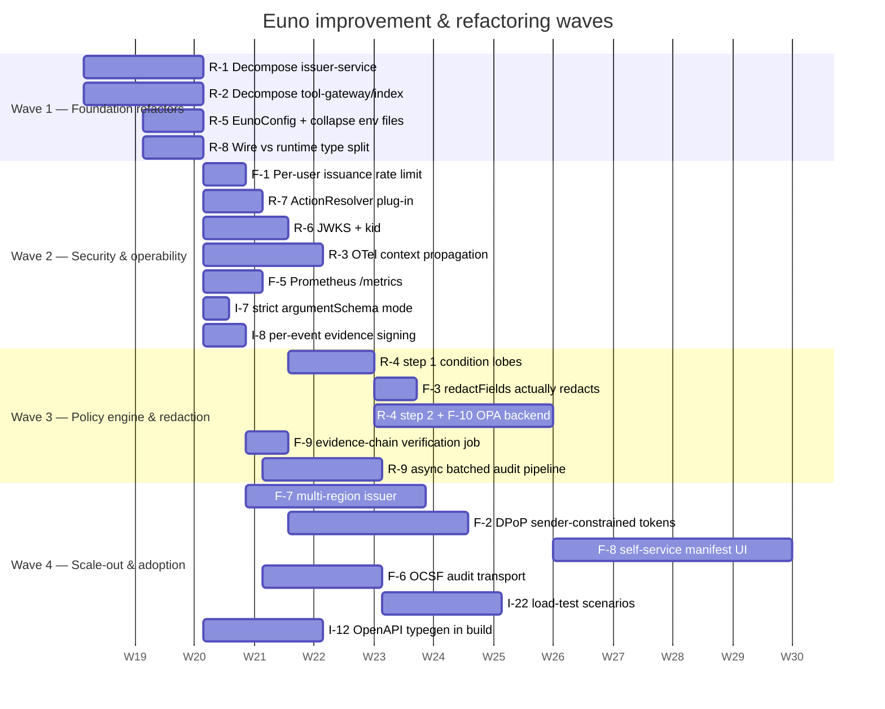
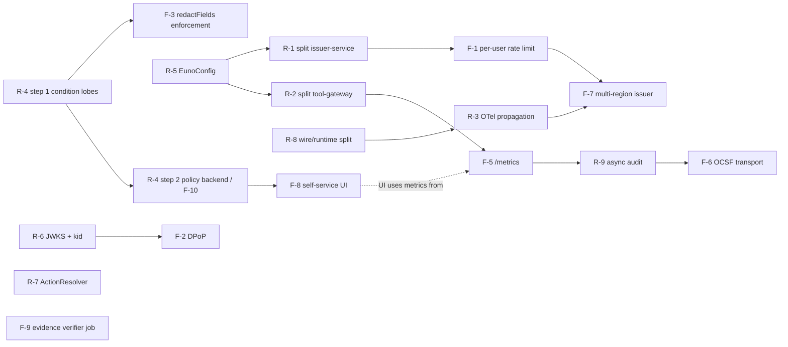

# Euno — Architecture & Design Evaluation, Improvements, and Refactoring Plan

> **Companion to:** [`ARCHITECTURE.md`](./ARCHITECTURE.md) (current
> implementation reference) and
> [`NEXT_STEPS_BACKLOG.md`](./NEXT_STEPS_BACKLOG.md) (Sprint 7+ feature
> backlog hand-off).
>
> **Scope:** This document evaluates the architecture and design of the
> code in `packages/` as it stands today, identifies concrete
> improvement and refactoring opportunities, and proposes a phased
> execution plan. It deliberately overlaps with the Sprint 7+ backlog
> only where the *engineering* shape of the change is worth calling out
> (for example, the OPA / Cedar work) and otherwise focuses on internal
> quality, maintainability, security, and operability — areas the
> backlog is silent on.
>
> No code changes are required to act on this document; it is the
> input to the next planning cycle.

---

## 1. Evaluation framework

The architecture is evaluated against six criteria, each scored on
a 1–5 scale. Scores are *qualitative* and based on reading the code in
`packages/` plus the existing design docs.

| Criterion              | Score | One-line justification                                                                                                  |
| ---------------------- | :---: | ----------------------------------------------------------------------------------------------------------------------- |
| **Security**           |  4.5  | Strong fail-closed posture, KMS-bound signing, typed conditions, distributed kill-switch. Gaps: per-user issuance rate limit, DPoP, response redaction is audit-only. |
| **Modularity**         |  4    | Clean monorepo, adapter interfaces, discriminated-union conditions. Two service modules (`issuer-service.ts`, `tool-gateway/index.ts`) are now monolithic and warrant decomposition. |
| **Operability**        |  3.5  | Sentinel rules, kill-switch, runbooks, HPA, and cross-cloud profiles all present. Missing: distributed tracing, per-tenant metrics, structured config validation. |
| **Performance**        |  3.5  | Stateless services, Redis for shared state. Hot-path could benefit from in-process key/JWKS caching, async batched audit writes. No load-test artefacts in the repo. |
| **Extensibility**      |  4    | Adapters (identity, signer, DID resolver, condition handler) are first-class. The custom-condition path needs a stronger contract for handler discovery in production. |
| **Documentation**      |  4.5  | One of the project's strongest dimensions — `docs/README.md` is a real index, not a dump. Missing: an authoritative architecture reference (filled in by [`ARCHITECTURE.md`](./ARCHITECTURE.md) in this PR). |
| **Aggregate**          | **4.0** | A solid, security-first MVP that has crossed the "production pilot" line. Improvements below are about durability, not viability. |

---

## 2. Strengths to preserve

These are working well; any refactoring should keep them intact.

1. **Discriminated-union conditions** with mandatory registry handlers
   (`packages/common/src/condition-registry.ts`). Unknown `type` ⇒ hard
   reject at both mint and enforcement. This pattern should be extended
   (not replaced) by any policy-engine work.
2. **Adapter pattern** for identity providers, signers, and DID
   resolvers (`packages/common/src/adapters.ts`,
   `packages/capability-issuer/src/default-registries.ts`). Cloud
   portability is real, not aspirational.
3. **Schema versioning** (`CAPABILITY_TOKEN_SCHEMA_VERSION` +
   `SUPPORTED_SCHEMA_VERSIONS`). Fail-closed evolution is hard to add
   later — keep this as the model for future versioned artefacts.
4. **Distributed primitives behind a single env var.** Setting
   `REDIS_URL` upgrades kill-switch, revocation, and call counters
   simultaneously without code changes. Excellent operator experience.
5. **Cryptographic audit refuses to start unsigned.** The change in
   `tool-gateway/src/index.ts` ll. 135–156 turns a previously fail-open
   warning into a startup error. This is exactly the right default.
6. **Test:source ratio of ~0.7.** Well above the typical infrastructure
   project; integration-tests cover the issuer ↔ gateway ↔ runtime
   path end-to-end.

---

## 3. Identified issues, in priority order

Each issue is given an ID (`I-N`), a severity, and a rough effort.
Severity uses the security industry's `Critical / High / Medium / Low`
ladder; effort is `S` (≤ 1 sprint), `M` (1–2 sprints), `L` (>2 sprints).

### 3.1 Security & correctness

| ID    | Severity | Effort | Issue                                                                                                                                               |
| ----- | :------: | :----: | --------------------------------------------------------------------------------------------------------------------------------------------------- |
| I-1   | High     |   S    | **No per-user / per-token issuance rate limit at the issuer.** Express rate-limit at `/issue` is per-IP only. A compromised user account can mint unlimited tokens until detection. |
| I-2   | High     |   M    | **No DPoP / sender-constrained tokens.** A captured JWT is a bearer secret usable by any caller until revoked. Adding DPoP (RFC 9449) ties tokens to the agent's keypair and aligns with the "Agent DID identity + keypair" claim already in `diagrams.md` § A1. |
| I-3   | High     |   M    | **`redactFields` condition is audit-only.** The gateway records the obligation but does not mutate the response. A capability that *says* "redact PII" currently provides no enforcement. |
| I-4   | Medium   |   S    | **HTTP-method → action mapping is a fixed table** in `tool-gateway/src/index.ts` ll. 292–298. Any backend that uses `POST` for read-style RPC (very common for GraphQL, search, and SDKs that disable GETs with a body) is over-authorized as `write`. |
| I-5   | Medium   |   S    | **Action coercion in `actionToCaTier` uses substring matching** (`a.includes('write')`, `a.includes('delete')`). A custom verb like `acknowledge` (`includes('know')` no, but `forward_delete_request` would tier as `delete`) can land in the wrong CA tier. Replace with a registered, declarative mapping per verb. |
| I-6   | Medium   |   M    | **No JWKS-style key rotation contract for the local issuer.** `/api/v1/public-key` returns a single SPKI; rotating it requires every gateway to restart or reload at the same time. JWKS with `kid` selection plus a small TTL would let issuer and gateway rotate independently. |
| I-7   | Medium   |   S    | **Argument validator runs only when `argumentSchema` is present** (`enforcement.ts`); there is no opt-in "schema required" mode at the gateway, so a missing schema silently relaxes input validation. ✅ Resolved — set `ARGUMENT_SCHEMA_REQUIRED=true` to deny matched capabilities that lack an `argumentSchema`. |
| I-8   | Low      |   S    | **`enableCryptographicAudit` is a single boolean** at the gateway. The asymmetric case (sign critical events but not all events) is impossible to express today. ✅ Resolved — `EVIDENCE_SIGNED_DECISIONS` is a CSV of `allow,deny` that overrides the legacy boolean (e.g. `EVIDENCE_SIGNED_DECISIONS=deny` signs refusals only). |

### 3.2 Modularity & maintainability

| ID    | Severity | Effort | Issue                                                                                                                                               |
| ----- | :------: | :----: | --------------------------------------------------------------------------------------------------------------------------------------------------- |
| I-9   | High     |   M    | **`issuer-service.ts` is 1,569 LOC** in a single file. It conflates: IdP integration glue, role mapping, manifest enforcement, consent enforcement, PIM checks, payload assembly, signing, posture emission, storage-grant and DB-token side services, and policy loading. Splitting it is the single highest-leverage refactor for maintainability. |
| I-10  | High     |   M    | **`tool-gateway/index.ts` is 679 LOC** of Express wiring + middleware + route handlers + admin mounting + initialization. Should be decomposed into `app-factory.ts` (composable, testable) + `bootstrap.ts` (env wiring) + per-route modules. The current shape is hard to unit-test without spinning the whole server. |
| I-11  | Medium   |   M    | **`packages/common/src/types.ts` is 1,304 LOC** and exports both wire types (token shape) and runtime types (`UserContext`, `ResolvedRole`). A wire-type module (`types/token.ts`, etc.) cleanly separated from runtime types would let downstream consumers depend on the wire schema only. |
| I-12  | Medium   |   S    | **No schema-derived TypeScript types for HTTP boundaries.** `openapi/` exists but is hand-curated against TypeScript types. A generator (e.g. `openapi-typescript`) would prevent drift. |
| I-13  | Medium   |   S    | **Two `.env` files per service** (`.env.example` *and* `.env.template`) with overlapping content. Pick one canonical name + a Zod-style validator for env vars at boot (issuer fails fast on misconfig today only for some flags, not all). |
| I-14  | Low      |   S    | **`PostureEmitterLike` is declared inline in `issuer-service.ts`** (ll. 41–52) instead of in `@euno/common`. Promote it to a shared interface so other services can also emit. |

### 3.3 Operability & observability

| ID    | Severity | Effort | Issue                                                                                                                                               |
| ----- | :------: | :----: | --------------------------------------------------------------------------------------------------------------------------------------------------- |
| I-15  | High     |   M    | **No distributed tracing.** Already flagged in `NEXT_STEPS_BACKLOG.md` § 4. Without OpenTelemetry context propagation across IdP → issuer → runtime → gateway → backend, every incident triage starts by stitching log timestamps. |
| I-16  | Medium   |   S    | **Metrics emission is ad-hoc.** Health endpoints exist; no Prometheus / OpenMetrics surface for the standard gateway latency, deny-rate, and revocation-list size series that operators need. |
| I-17  | Medium   |   S    | **No structured "capability-decision" event type** distinct from generic audit log. Sentinel rules in `infra/sentinel/analytic-rules.json` work around this with KQL filters; a typed event would be cheaper to query and OCSF-mappable. |
| I-18  | Low      |   S    | **`web/index.html` is a 283-line marketing/static stub.** It is enumerated as the foundation for the Sprint 7+ self-service UI; until then, it should be archived under `web/marketing/` to avoid implying functionality that does not exist. |
| I-19  | Low      |   S    | **Health check is `200` on liveness only.** Add a real readiness probe: issuer should fail-ready until the KMS handle is bound; gateway should fail-ready until the issuer's public key has been fetched (`initializeServices()` already gates this — surface it). |

### 3.4 Performance & scale

| ID    | Severity | Effort | Issue                                                                                                                                               |
| ----- | :------: | :----: | --------------------------------------------------------------------------------------------------------------------------------------------------- |
| I-20  | Medium   |   S    | **Issuer's public key is fetched once at gateway boot** (`tool-gateway/src/index.ts` ll. 66–70). Add a refresh loop (with backoff) so a hot rotation does not require a redeploy. |
| I-21  | Medium   |   M    | **No batched / async audit pipeline.** `EvidenceSigner.sign()` is on the request critical path. A small ring-buffer with backpressure (drop with metric, never lose) would let crypto-audit scale to gateway p99 budgets. |
| I-22  | Low      |   M    | **No load-test artefacts.** `packages/integration-tests` is functional only. A k6 / autocannon scenario per route would let the team set and defend SLOs. |
| I-23  | Low      |   S    | **DID document resolution caching policy is not documented.** Code in `did-resolver.ts` caches; the TTL and invalidation contract should be a public knob with a stated default. |

### 3.5 API & developer experience

| ID    | Severity | Effort | Issue                                                                                                                                               |
| ----- | :------: | :----: | --------------------------------------------------------------------------------------------------------------------------------------------------- |
| I-24  | Medium   |   S    | **Two `.env` template files** (see I-13) and adapter selection by env-var-only. A single typed `EunoConfig` loaded at boot, with a JSON-schema-emitting `euno config doctor` CLI subcommand, would shorten onboarding. |
| I-25  | Medium   |   S    | **Error codes are stringly-typed** (`ErrorCode` in `@euno/common`). They cross the wire and into Sentinel rules; promote to a versioned enum with reverse-compatibility tests. |
| I-26  | Low      |   S    | **CLI `euno init` does not generate matching gateway routes** — it scaffolds the agent side only. A `--with-proxy` flag emitting a sample `tool-gateway` config would shorten the first-run loop. |

---

## 4. Refactoring proposals (R-N)

Refactors are *structural* changes that do not (necessarily) add
features but make the system easier to extend and reason about. Each
maps to one or more issues above.

### R-1 — Decompose `issuer-service.ts`  (addresses I-9, I-14)

Split `packages/capability-issuer/src/issuer-service.ts` (1,569 LOC)
into the following cohesive modules under
`packages/capability-issuer/src/issuance/`:

- `issuance/manifest.ts` — `AgentCapabilityManifest` resolution and
  intersection with the requested capability set.
- `issuance/consent.ts` — `UserConsent` validation +
  `SENSITIVE_ACTIONS` gate.
- `issuance/role-resolution.ts` — wraps `IdentityProvider` +
  `mapRolesToCapabilitiesForPolicy`. PIM cap on TTL lives here.
- `issuance/payload-builder.ts` — pure function: inputs → signed
  payload struct (no I/O).
- `issuance/signer-pipeline.ts` — drives `TokenSigner` adapter,
  computes `canonicalSha256` digest, returns JWS.
- `issuance/posture.ts` — owns `PostureEmitterLike` and produces
  `AgentInventoryRecord` from each issuance.
- `issuer-service.ts` — orchestrator only; ~150 LOC; injects each of
  the above.

The orchestrator becomes a thin coordinator that is straightforward to
unit-test by injecting fakes for each collaborator. Promote
`PostureEmitterLike` into `@euno/common` (resolves I-14).

### R-2 — Decompose `tool-gateway/index.ts`  (addresses I-10, I-19)

Split `packages/tool-gateway/src/index.ts` (679 LOC):

- `app-factory.ts` — `createApp(deps): express.Application`. Pure
  composition; no env reads, no listening, no Redis connection.
- `bootstrap.ts` — env loading, dependency wiring (verifier,
  enforcement engine, kill-switch, evidence signer), startup errors.
- `routes/proxy.ts` — `validateCapabilityMiddleware` +
  `httpProxyMiddleware`.
- `routes/validate.ts` — `/api/v1/validate` for testing.
- `routes/health.ts` — split liveness vs readiness; readiness depends
  on `initializeServices()` having completed (resolves I-19).

The factory pattern lets `packages/integration-tests` build a gateway
in-process without HTTP — substantial test-speed improvement.

### R-3 — Wire OpenTelemetry context propagation  (addresses I-15)

Adopt `@opentelemetry/api` in `@euno/common` and propagate a single
`traceparent` header from the agent runtime through the gateway to the
backend. Each of issuer / gateway / runtime emits one span per request
with attributes `euno.agent_id`, `euno.jti`, `euno.action`,
`euno.resource`, `euno.outcome`. The audit logger consumes the active
span context so every audit event carries `trace_id` and `span_id`.
This is invasive at the *integration* level but additive at the *type*
level; it should not break existing callers.

### R-4 — Promote conditions registry into a policy-engine boundary  (addresses I-3, and supports the Sprint 7+ OPA/Cedar item)

Today, the registry conflates **validation** (mint-time) and
**enforcement** (request-time) per condition type. Refactor in two
steps:

1. Split each handler into `{ validate, enforce, redact? }` lobes. The
   `redact` lobe is new and lets `RedactFieldsCondition` actually
   strip fields on the response path (closes I-3).
2. Add a `'policy'`-typed condition with a pluggable backend. Backends
   register the same `{ validate, enforce, redact? }` shape, so OPA /
   Cedar / a future engine can be added without changes to the
   gateway middleware.

Critically, **do not introduce a `kind:` field**: the existing
discriminated union on `type` is the right contract and is already
called out as load-bearing in `NEXT_STEPS_BACKLOG.md`.

### R-5 — Move from per-service `.env*.example` files to typed `EunoConfig`  (addresses I-13, I-24)

Define `EunoConfig` in `@euno/common` (Zod schema). Each service
calls `loadConfig(process.env)` at boot; misconfig produces a single,
structured "what's wrong" report rather than partial defaults. The
existing `.env.example` files are regenerated from the schema by a CLI
subcommand (`euno config dump-template --service issuer`), eliminating
the `.env.template` vs `.env.example` duplication.

### R-6 — JWKS + `kid` instead of single SPKI  (addresses I-6, I-20)

> **STATUS: IMPLEMENTED** (PR: R-6 JWKS key rotation)
>
> **Deprecation notice**: `GET /api/v1/public-key` is deprecated. Migrate to
> `GET /.well-known/jwks.json`. The legacy endpoint continues to work for one
> deprecation cycle (it now returns a `Deprecation` response header and emits
> a `warn` log line on every call). It will be removed in a future release.

Replace `/api/v1/public-key` (single SPKI) with `/.well-known/jwks.json`
(JWK set with `kid`). Gateway:

- Caches the JWKS with a configurable TTL (default 5 min).
- On signature verification, selects the key by `kid` from the JWT
  header.
- Rotation procedure: issuer adds key 2 to JWKS, waits one TTL, signs
  with key 2, eventually removes key 1 — never a synchronized restart.

This unifies the local-issuer and partner-DID code paths in `verifier.ts`
(both end up with a JWKS-shaped key source), and lets the same caching
strategy apply to both.

### R-7 — Action mapping plug-in  (addresses I-4, I-5)

Replace the fixed `actionMap` in `tool-gateway/src/index.ts` ll.
292–298 and the heuristic `actionToCaTier` with a single
`ActionResolver` interface in `@euno/common`:

```text
ActionResolver {
  fromHttpRequest(method, path, body, headers): Action
  toCaTier(action): CaActionTier
}
```

A default implementation reproduces the current behaviour. Operators
inject a deployment-specific resolver (e.g. one that knows the
backend's GraphQL operation map). The CA tiering becomes data-driven
(`{ "db:select": "read", "db:insert": "write", ... }`), eliminating
the substring-matching surprise.

### R-8 — Split wire types from runtime types in `@euno/common`  (addresses I-11, I-12)

Move types into:

- `@euno/common/wire` — `CapabilityTokenPayload`,
  `CapabilityCondition`, `IssueCapabilityRequest/Response`,
  `ValidateActionRequest/Response`, error envelopes.
- `@euno/common/runtime` — `UserContext`, `ResolvedRole`,
  `AgentInventoryRecord`, `KillSwitchManager`, etc.

Then add `openapi-typescript` to the build to *generate* the wire
namespace from `docs/openapi/` (or vice-versa). Pick one direction —
spec-first is recommended because the OpenAPI document is already the
contract for clients.

### R-9 — Async batched audit pipeline  (addresses I-21)

Introduce `AuditPipeline` in `@euno/common`:

- Bounded ring buffer (size + age limits).
- N background workers calling `EvidenceSigner.sign(batch)`.
- Backpressure policy: `drop_oldest_with_metric` (default) or `block`
  (strict-mode operators). Always emits a counter so dropped events
  are visible.

The `EnforcementEngine` enqueues on the request critical path and
returns immediately; signing latency no longer adds to the agent's
p99.

---

## 5. Improvements (feature-shaped, not refactoring)

These are *new* capabilities, distinct from the structural refactors
above. They overlap with `NEXT_STEPS_BACKLOG.md` where flagged.

| ID    | Improvement                                                        | Notes                                                                                       |
| ----- | ------------------------------------------------------------------ | ------------------------------------------------------------------------------------------- |
| F-1   | Per-user / per-token issuance rate limit (I-1)                     | Token bucket keyed by `sub` + `agentId` at the issuer. Surfaces metric for I-16.            |
| F-2   | DPoP sender-constrained tokens (I-2)                               | Adds a `cnf.jkt` claim at mint; gateway verifies the DPoP proof matches. Requires runtime support to sign per-request. |
| F-3   | Response redaction obligation (I-3, R-4)                           | Backed by R-4 step 1.                                                                       |
| F-4   | OpenTelemetry tracing across services (I-15, R-3)                  | Same as backlog item.                                                                       |
| F-5   | Prometheus / OpenMetrics surface (I-16)                            | `/metrics` on issuer + gateway.                                                             |
| F-6   | OCSF-formatted audit transport (I-17)                              | Already foreshadowed in `NEXT_STEPS_BACKLOG.md` § 4.                                        |
| F-7   | Multi-region active/active issuer (backlog § 3)                    | Requires F-1 to be tenant-aware to avoid cross-region double-spend on issuance limits.       |
| F-8   | Self-service manifest UI (backlog § 1)                             | Replaces `web/index.html`; pre-requisite is an issuer admin API for manifest CRUD.          |
| F-9   | Continuous evidence-chain verification job (backlog § 4)           | Wraps `AuditEvidenceSigner.verifyEvidence`.                                                 |
| F-10  | OPA / Cedar policy backend (backlog § 2, R-4 step 2)               | `'policy'` condition type with handler.                                                     |

---

## 6. Execution plan

### 6.1 Sequencing rules

1. **Refactors that unblock multiple features come first.** R-1, R-2,
   R-3, R-4, R-5 are all on the critical path.
2. **Security gaps with low effort outrank features.** I-1 (F-1), I-3
   (R-4 step 1 + F-3), I-4 (R-7), I-19 (R-2) precede roadmap items.
3. **Don't ship F-7 (multi-region active/active) before F-1 (per-user
   rate limit) is tenant-aware.** Otherwise a compromised user can
   simply mint in both regions.
4. **No structural refactor without test-coverage parity.** Each `R-N`
   PR includes new unit tests for the extracted modules; integration
   tests must remain green.

### 6.2 Phased plan

The plan is grouped into four phases ("waves") of roughly one to two
sprints each. Each wave has an explicit exit criterion so progress is
externally observable.

#### Wave 1 — Foundation refactors (1–2 sprints)

| Item | Description                                          | Owner candidate            |
| ---- | ---------------------------------------------------- | -------------------------- |
| R-1  | Decompose `issuer-service.ts`                        | Issuer maintainers         |
| R-2  | Decompose `tool-gateway/index.ts` + readiness probe  | Gateway maintainers        |
| R-5  | Typed `EunoConfig`; collapse `.env*.example` files   | Platform / DX              |
| R-8  | Split wire vs runtime types in `@euno/common`        | Common-library maintainers |

**Exit criterion:** Public API of each service is unchanged
(integration tests pass without modification); the four refactored
modules each fit under 400 LOC; the new `EunoConfig` validator catches
at least the existing fail-closed error cases at boot.

#### Wave 2 — Security & operability hardening (1–2 sprints)

| Item       | Description                                                       |
| ---------- | ----------------------------------------------------------------- |
| F-1 (I-1)  | Per-user / per-token issuance rate limit                          |
| R-7 (I-4, I-5) | `ActionResolver` plug-in; data-driven CA tiering              |
| R-6 (I-6, I-20) | JWKS + `kid` for issuer; gateway hot-rotates keys            |
| R-3 (I-15) | OpenTelemetry context propagation                                 |
| F-5 (I-16) | `/metrics` Prometheus endpoint on issuer + gateway                |
| I-7        | Optional `argument-schema-required` strict mode at the gateway    |
| I-8        | Per-event-type evidence signing (replaces single boolean)         |

**Exit criterion:** A staging incident that requires a per-user token
freeze can be done from the admin API in under one minute; a single
trace ID surfaces every span from `/issue` to backend response in the
chosen tracing backend.

#### Wave 3 — Policy engine & response obligations (2 sprints)

| Item       | Description                                                       |
| ---------- | ----------------------------------------------------------------- |
| R-4 step 1 | `{ validate, enforce, redact }` shape for condition handlers      |
| F-3        | `redactFields` actually strips response fields                    |
| R-4 step 2 + F-10 | `'policy'` condition with OPA backend (Cedar follow-up)    |
| F-9        | Continuous evidence-chain verification job                        |
| R-9 (I-21) | Async batched audit pipeline                                      |

**Exit criterion:** A capability whose only declared restriction is
`{ "type": "redactFields", "fields": ["ssn", "address"] }` causes
those fields to be stripped from the proxied response in tests; an OPA
policy can be referenced from a manifest and is enforced end-to-end.

#### Wave 4 — Scale-out & adoption surface (≥ 2 sprints)

| Item       | Description                                                       |
| ---------- | ----------------------------------------------------------------- |
| F-7        | Multi-region active/active issuer (depends on F-1 tenant-aware)   |
| F-2        | DPoP sender-constrained tokens                                    |
| F-8        | Self-service manifest UI; archive `web/index.html` stub (I-18)    |
| F-6        | OCSF audit transport                                              |
| I-22       | Load-test artefacts in `packages/integration-tests/perf/`         |
| I-12       | OpenAPI ↔ TypeScript generator wired into the build              |

**Exit criterion:** A regional Azure outage takes the active gateway
offline; the second region serves issuance and enforcement within the
documented RTO/RPO; a manifest authored in the UI flows through review
and into a token in production.

### 6.3 Plan-on-a-page



> Dates above are illustrative (a sample 2-week-sprint cadence). The
> structural relationship between bars — what blocks what — is the
> load-bearing part.

### 6.4 Dependency graph



### 6.5 Risk register

| Risk                                                                                         | Likelihood | Impact | Mitigation                                                                                              |
| -------------------------------------------------------------------------------------------- | :--------: | :----: | ------------------------------------------------------------------------------------------------------- |
| R-1 / R-2 introduce regressions because monolithic files are also where most behaviour lives |    Med     |  High  | Land integration tests *before* the refactor PR; require coverage parity check in CI                    |
| R-4 step 2 (OPA/Cedar) becomes a multi-quarter detour                                        |    Med     |  Med   | Time-box the spike; ship R-4 step 1 + F-3 independently so redaction is unblocked even if step 2 slips  |
| F-7 multi-region issuer ships before F-1 is tenant-aware                                     |    Low     |  High  | Hard sequencing rule in §6.1 #3; reviewer checklist on F-7 PR                                           |
| OpenTelemetry adds latency on the hot path                                                   |    Low     |  Med   | Use OTel batch exporter; bench the gateway p99 before/after in CI                                       |
| Refactor effort starves new feature work                                                     |    Med     |  Med   | Wave 1 is intentionally one short wave; subsequent waves interleave refactors and features              |
| JWKS rotation breaks live tokens during cutover                                              |    Low     |  High  | R-6 explicitly requires *overlap* (key 2 in JWKS for one TTL before signing with it); incident drill before prod |

### 6.6 Definition of done (per item)

A change in this plan is "done" when *all* of the following hold:

1. Unit tests cover the new module's public surface; coverage delta
   on `packages/<changed>` is ≥ 0%.
2. `packages/integration-tests` runs green without modification (or, if
   modification is required, the diff is documented in the PR body and
   linked to a backwards-compatibility note).
3. Each new public type or env var is reflected in
   [`ARCHITECTURE.md`](./ARCHITECTURE.md) §§ 4 / 8 *and* in the
   matching service's `.env.example` (or the regenerated template
   from R-5).
4. Each new operational knob is mentioned in
   `PRODUCTION_DEPLOYMENT_CHECKLIST.md`.
5. Every removal or rename has a deprecation entry in the change-log
   (or a major-version bump on the package, post R-8).

---

## 7. Out of scope (for this document)

- Re-evaluating the *capability model itself*. That work is owned by
  [`capability-model.md`](./capability-model.md) and only revisited if
  external research forces a model change (e.g. a new attack class).
- Replacing the discriminated-union conditions with a `kind:` /
  `type:` dual-discriminator scheme. The current contract is
  load-bearing across issuer mint, gateway enforcement, partner trust,
  and the Sentinel rules — see `NEXT_STEPS_BACKLOG.md` § 2.
- Multi-tenant *data plane* isolation beyond what Kubernetes
  namespaces + network policies already provide. A true multi-tenant
  SaaS deployment is a distinct product question, not a refactor.
- Changing the build / package-manager toolchain (npm workspaces). The
  monorepo layout is fine; tooling churn would consume budget without
  changing outcomes for any item above.

---

## 8. Summary

Euno's architecture is sound, security-first, and already past pilot.
The biggest near-term wins come not from new features but from two
structural refactors (R-1, R-2) that pay down the only real complexity
debt in the codebase, plus a small set of high-leverage hardening
items (F-1, R-6, R-3) that close visible operability and security
gaps. Following the four-wave sequence in §6 keeps the system shippable
at every milestone — no wave leaves the codebase in a half-migrated
state — while making space for the larger Sprint 7+ items
(self-service UI, dynamic policy engine, multi-region issuer) without
re-litigating the foundations.
