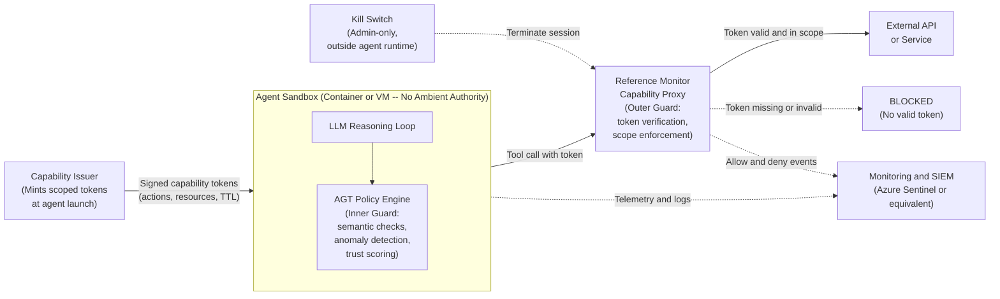
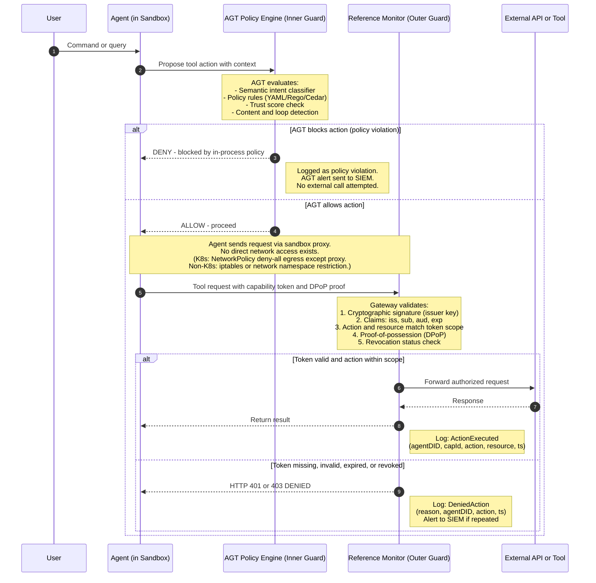
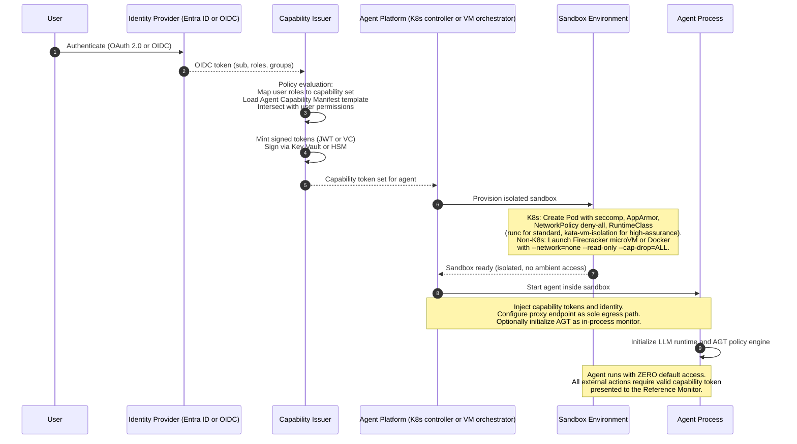
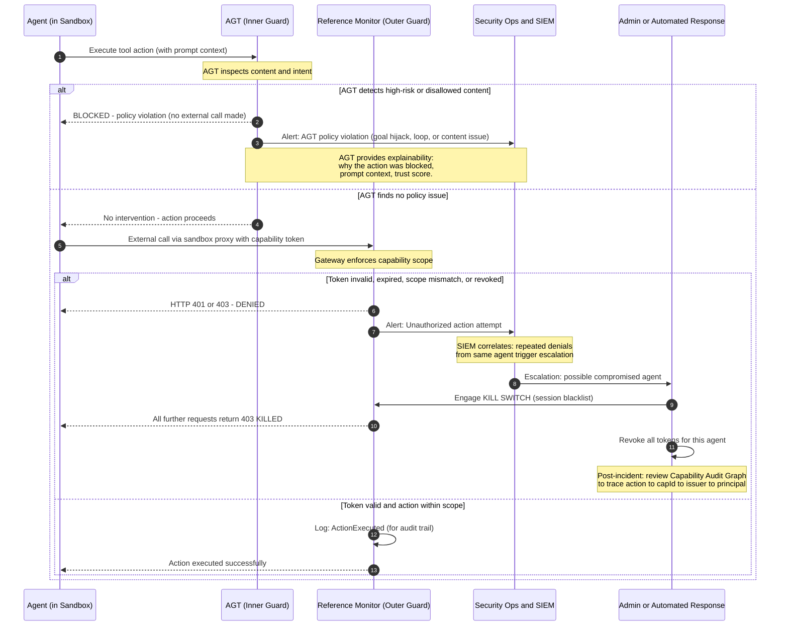

## DIAGRAM 1: High-Level Architecture — Sandbox and AGT Integration
Shows layered defense: AGT as inner guard, Sandbox + Gateway as outer guard

## DIAGRAM 2: Runtime Action Enforcement Flow
AGT evaluates intent (soft guard); Gateway enforces capability (hard guard)

Environment: Kubernetes (sidecar proxy) or non-K8s (host proxy)

## DIAGRAM 3: Control-Plane Lifecycle — Agent Creation and Sandbox Provisioning
Shows identity issuance, sandbox setup, and capability injection

## DIAGRAM 4: Incident and Enforcement Flow — Violation, Revocation, Kill-Switch
Shows dual-layer detection and escalation path
