# Comprehensive Mermaid Diagram Set: Capability‑Native Agent Governance

Three diagram sets follow — each tailored to a distinct audience. Every diagram uses valid Mermaid syntax, labels entities and data objects explicitly, and marks trust boundaries via subgraphs. Azure services appear as reference implementations with generic alternatives noted in labels. 


## SET A — Engineering Implementation Diagrams

These diagrams carry field-level detail on data objects, cryptographic operations, and protocol flows for implementation engineers. 


### A1 — End‑to‑End System Architecture
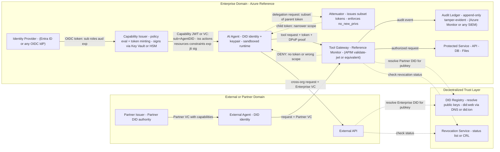
Legend:
|Symbol|Meaning|
| --- | --- |
|Solid arrow|Primary data flow (label shows data object and key fields)|
|Dashed arrow|Verification / lookup flow|
|Subgraph boundary|Trust boundary — components inside share a trust domain|

|Data Object|Key Fields|
| --- | --- |
|OIDC Token|sub (userID), roles, aud, exp, iss (IdP)|
|Capability Token (JWT/VC)|sub (Agent DID), iss (Enterprise DID), actions[], resources[], constraints{ttl, max_calls, redact}, exp, jti (unique ID), signature|
|DID Document|id (DID), verificationMethod[] (public keys), service[] (endpoints for registry, revocation), authentication[]|
|Audit Log Event|timestamp, agentDID, capabilityId, action, resource, outcome (allow/deny), parentCapId (if delegated)|

The validate-jwt policy on Azure APIM enforces existence and validity of the JWT extracted from a specified HTTP header, checking issuer, audience, expiration, required claims, and signature against configured signing keys【6†L16-L22】. Any API gateway with JWT validation (AWS API Gateway + Lambda Authorizer, Envoy with JWT filter, NGINX with auth module) serves the same role. 


### A2 — Identity and Capability Issuance Flow
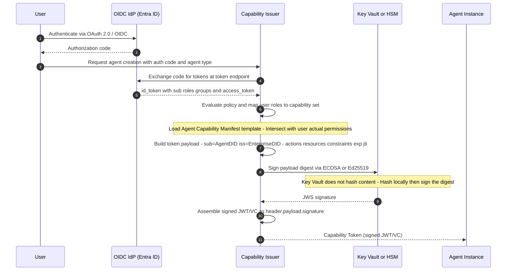

```
Capability Token payload example: 
{
  "iss": "did:web:enterprise.example.com",
  "sub": "did:web:enterprise.example.com:agents:triage-123",
  "aud": "https://apim.enterprise.example.com",
  "exp": 1745678400,
  "jti": "8457e9ab-1234-abcd-ef01-567890abcdef",
  "cap": {
    "actions": ["read", "search"],
    "resources": ["logs://cluster/A/*"],
    "constraints": {
      "ttl_seconds": 900,
      "redact": ["pii", "secrets"],
      "max_calls": 100
    }
  },
  "no_new_privs": true
}
```

The signing step uses Azure Key Vault's sign operation, which creates a signature from a digest — the hash is computed locally before calling the Key Vault API【5†L287-L289】. On AWS the equivalent is KMS Sign; on GCP it is Cloud KMS asymmetricSign. 


### A3 — Tool Invocation and Enforcement Flow
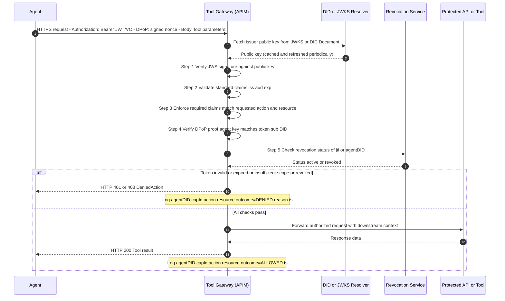
Enforcement semantics: APIM's validate-jwt policy checks that the token was issued by a trusted issuer, targets the correct audience, has not expired, and contains required claims matching the requested operation. Required claims configured via ensure that only tokens explicitly listing the needed action scope pass validation. Tokens lacking the correct scope are rejected with the configured failed-validation-httpcode (default 401)【6†L51-L52】【6†L68-L70】. 


### A4 — Delegation and Attenuation Flow
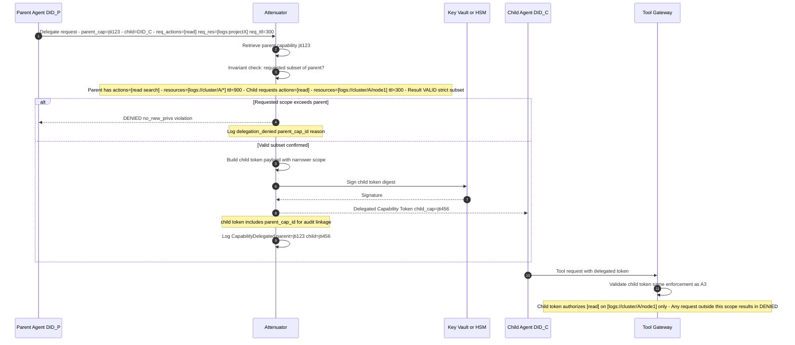
Attenuation rules:
|Parent Capability|Attenuation Allowed|Attenuation Denied|
| --- | --- | --- |
|actions: [read, search]|actions: [read] (subset)|actions: [read, write] (adds write)|
|resources: [logs://cluster/A/*]|resources: [logs://cluster/A/node1] (narrower)|resources: [logs://cluster/B/*] (different resource)|
|ttl: 900|ttl: 300 (shorter)|ttl: 1800 (longer)|
|max_calls: 100|max_calls: 50 (lower)|max_calls: 200 (higher)|


### A5 — Revocation and Kill‑Switch Propagation Flow
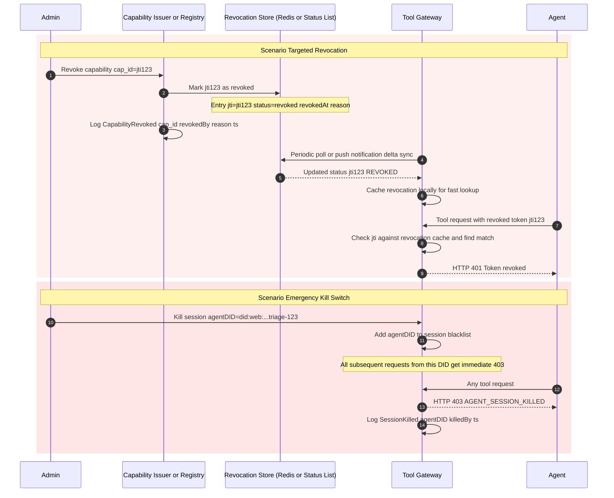
Revocation models compared:
|Model|Latency|Complexity|Best For|
| --- | ---- | ---- | ---- |
|Short TTL (5–15 min)|Passive; expires naturally|Low — no active revocation needed|Default baseline; reduces window of abuse|
|Revocation list (centralized)|Seconds (push) to minutes (poll)|Medium — requires distributed cache (e.g., Azure Cache for Redis)|Targeted token invalidation|
|DID Document status endpoint|Depends on resolution method|Higher — requires registry service discoverable via DID Document|Cross-org credential revocation|
|Kill-switch (session blacklist)|Immediate (in-memory)|Low — simple set lookup at Gateway|Emergency response|


## SET B — Security Review and Threat‑Modeling Diagrams

These diagrams emphasize trust boundaries, attack surfaces, and containment mechanisms for security architects and threat-modeling sessions. 


### B1 — Trust Boundaries and Attack Surfaces
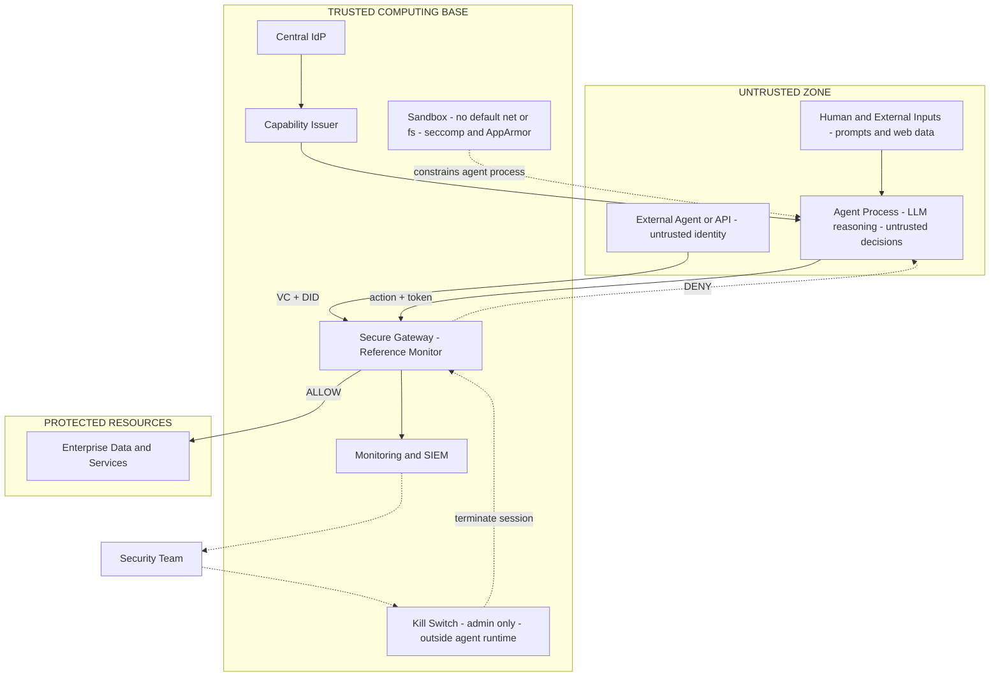
Attack surfaces at each trust boundary crossing:
|Crossing Point|Threat|Mitigation|
| --- | --- | --- |
|User Input to Agent|Direct prompt injection|Capability enforcement ensures injected instructions cannot trigger unauthorized actions|
|External Data to Agent|Indirect prompt injection via hidden instructions in documents|Agent may be influenced but lacks capability tokens for unauthorized operations|
|Agent to Gateway|Token forgery, replay, scope escalation|Signature verification, DPoP proof-of-possession, strict scope matching【6†L16-L22】|
|External Agent to Gateway|Compromised partner credential|Issuer DID verification, revocation checking, trust anchor validation|
|Gateway to Protected Resources|Confused deputy: Gateway acting on attacker behalf|Gateway enforces object-specific capability tokens not identity-based; each action requires a matching token|


### B2 — Token Replay vs Proof‑of‑Possession Defense
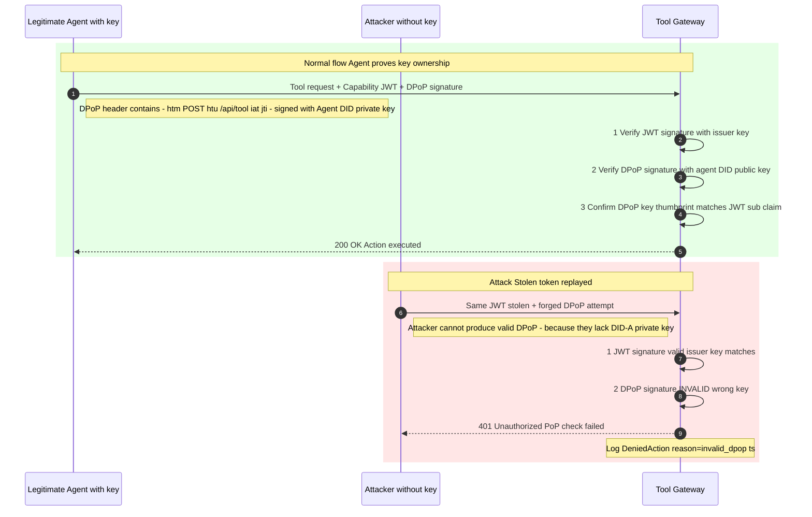
Security rationale: Without proof-of-possession, a stolen bearer token grants the attacker full authority for the token's lifetime. With DPoP, the attacker must also possess the agent's private key to produce a valid signature. Since the private key is held in protected memory (never exposed to the LLM's token stream), token theft alone is insufficient for exploitation. 


### B3 — Confused Deputy Containment via Constrained Delegation
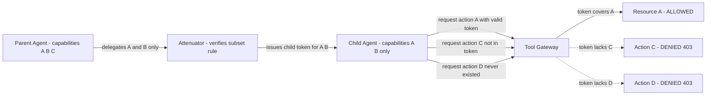
Blast radius analysis:
|Scenario|Without Capability Model|With Capability Model|
| --- | --- | --- |
|Child agent compromised via prompt injection|Full access to parent permissions A B C plus potentially ambient credentials|Access limited to delegated subset A B only|
|Attacker tries to escalate via child|Can invoke any API the parent identity has access to|Gateway rejects any request outside A B|
|Maximum damage|Unlimited within parent identity scope|Bounded to explicitly delegated actions on specific resources|

This is the mechanical solution to the confused deputy problem: the child agent's authority is provably bounded by the parent's explicit delegation, not by the child's claimed identity or the parent's ambient privileges. 


### B4 — Incident Response: Detection to Containment to Forensics
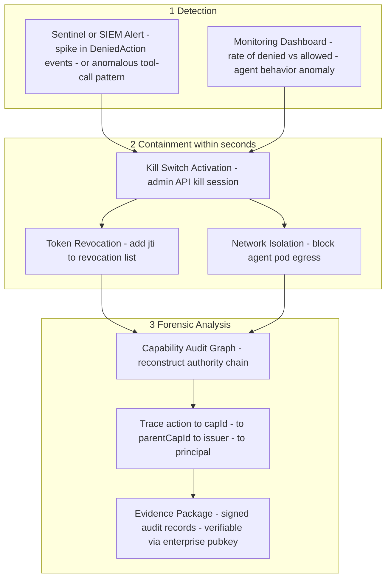
Forensic query examples supported by the Capability Audit Graph:
|Question|How the CAG Answers It|
| --- | --- | 
|What did the compromised agent do?|Query all ActionExecuted events where agentDID = compromised_agent|
|Who authorized this agent?|Trace CapabilityIssued event via issuedBy field to human principal DID|
|Could the agent have accessed Resource X?|Check if any capability with resource = X was ever issued to this agent|
|Did any sub-agent exceed parent authority?|Compare CapabilityDelegated events: verify child scope is a subset of parent scope for every delegation|
|Is the evidence tamper-proof?|Each audit record is signed with the enterprise Key Vault key — verifiable by any party with the public key【5†L287-L289】|


## SET C — Architecture Communication Diagrams

Simplified diagrams for architects, leadership, and cross-functional stakeholders. Focus on roles, responsibilities, and data flows rather than low-level mechanics. 


### C1 — Capability‑Native Governance Overview
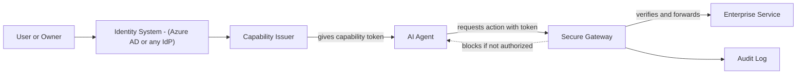
Key message for stakeholders: The agent never has direct access to enterprise resources. Every action must pass through the Secure Gateway, which mechanically verifies the agent's token before allowing any operation. If an agent is tricked by malicious input, it can attempt unauthorized actions — but those attempts are automatically blocked and logged. 


### C2 — Agent Authorization Lifecycle
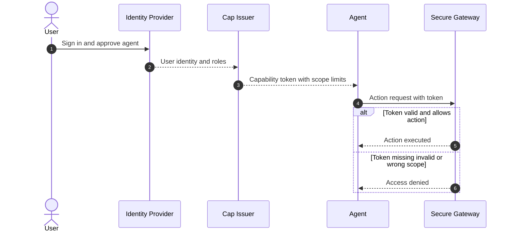
Stakeholder takeaway: This system converts the security question from "Will the AI follow its instructions?" to "Does the AI hold a valid token for this specific action?" — a question with a deterministic, verifiable answer. 


### C3 — Cross‑Organization Agent Trust via Verifiable Credentials
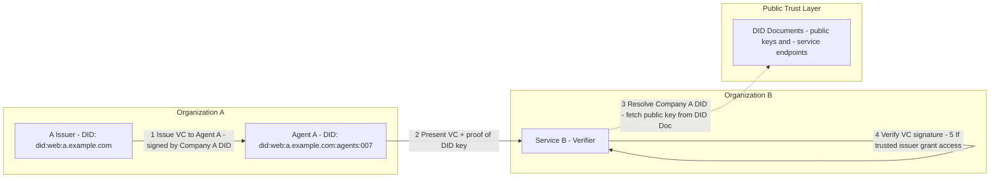
How it works (for non-technical stakeholders): 
1. Organization A issues a digital credential to its agent, cryptographically signed by Organization A's identity.

2. The agent presents this credential to Organization B's service.

3. Organization B looks up Organization A's public key from a public registry (no direct connection to Organization A's identity system needed).

4. Organization B verifies the credential's authenticity using that public key.

5. If Organization B trusts Organization A as an issuer (pre-configured), access is granted.

Research on AI agents equipped with W3C DIDs and VCs demonstrates that this approach enables agents to prove ownership of their self-controlled DIDs for authentication purposes and establish various cross-domain trust relationships through the spontaneous exchange of their self-hosted DID-bound VCs. The same research reveals that security-critical procedures such as VC verification should not be orchestrated solely by the LLM — they must be implemented as deterministic external controls, reinforcing the core principle that enforcement belongs in the trusted computing base, not in the agent's reasoning layer.

---

## SET D — AGT Integration Diagrams

These diagrams show the layered defense model when integrating with an
in-process policy engine (e.g. Microsoft AGT) alongside the euno capability
gateway.

### D1 — High-Level Architecture: Sandbox and AGT Integration

Shows layered defense — AGT as inner guard, Sandbox + Gateway as outer guard.

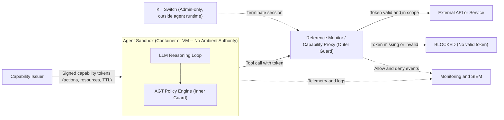

### D2 — Runtime Action Enforcement Flow

AGT evaluates intent (soft guard); Gateway enforces capability (hard guard).

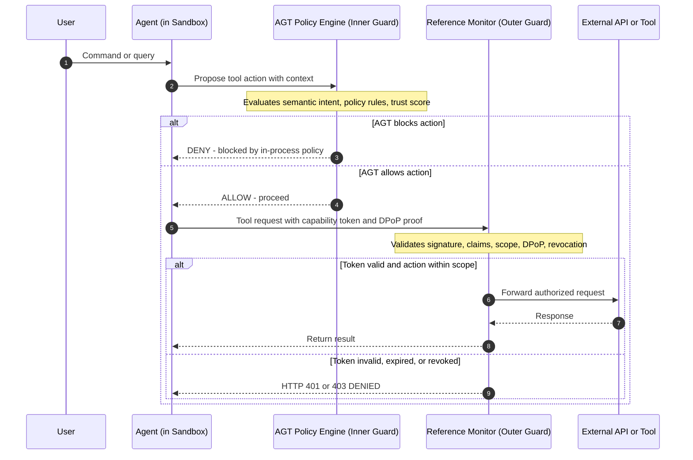

### D3 — Control-Plane Lifecycle: Agent Creation and Sandbox Provisioning

```mermaid
sequenceDiagram
    autonumber
    participant User
    participant IdP as Identity Provider
    participant Issuer as Capability Issuer
    participant Platform as Agent Platform
    participant Sandbox as Sandbox Environment
    participant Agent as Agent Process

    User->>IdP: Authenticate (OAuth 2.0 / OIDC)
    IdP-->>Issuer: OIDC token (sub, roles, groups)
    Issuer->>Issuer: Map roles to capability set; mint signed tokens
    Issuer-->>Platform: Capability token set
    Platform->>Sandbox: Provision isolated sandbox (deny-all egress)
    Sandbox-->>Platform: Sandbox ready
    Platform->>Agent: Start agent; inject tokens; set proxy as sole egress
    Agent->>Agent: Initialize LLM runtime and AGT policy engine
```

### D4 — Incident and Enforcement Flow: Violation, Revocation, Kill-Switch

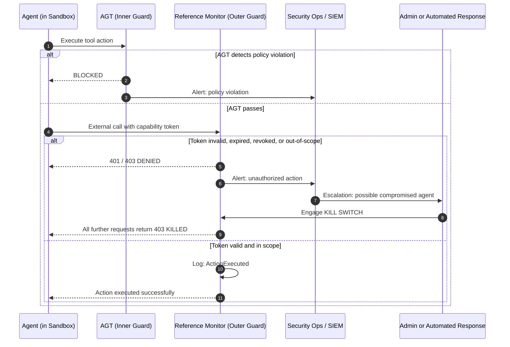
